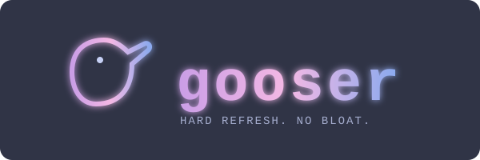

# gooser 🪿

A little cli app to goose ArgoCD to refresh Applications when your gRPC connection's
acting flaky. Pulls your default local kubeconfig.

For ephemeral clusters and impatient people.

Now with twiddling support: turn off yer sync policy options for maintenance or screwin'
around, turn 'em back on once you're through!



```
gooser              # pick an app from the TUI, then choose what to do
gooser my-app       # skip the TUI, goose it directly
gooser --version    # print version/commit/date
```

## What it does

### Goose (hard refresh)

Force ArgoCD to drop its cache and re-pull from Git — useful when your gRPC connection
has been flaky and ArgoCD is convinced everything is fine.

### Twiddle (toggle auto-sync)

Toggle the `spec.syncPolicy.automated` field on an application. Enabling it sets
`selfHeal: true` and `prune: true`; disabling it removes the field entirely.
Handy for temporarily freezing a noisy app without touching Git.

### TUI key bindings

| Key            | Action             |
| -------------- | ------------------ |
| `↑` / `k`      | Move up            |
| `↓` / `j`      | Move down          |
| `enter` / `g`  | Goose selected app |
| `t`            | Twiddle auto-sync  |
| `q` / `ctrl+c` | Quit               |

## How it works

ArgoCD applications are just Kubernetes custom resources. Rather than pulling in
`github.com/argoproj/argo-cd/v2` (and its several hundred transitive dependencies),
gooser talks to the Kubernetes API directly using a **dynamic client**.

### The GVR

Every resource in Kubernetes is identified by three coordinates:

| Field        | Value          |
| ------------ | -------------- |
| **Group**    | `argoproj.io`  |
| **Version**  | `v1alpha1`     |
| **Resource** | `applications` |

Together these form a `schema.GroupVersionResource` — the GVR. Given one, the dynamic
client can list, get, patch, or delete that resource without needing to know anything
about its schema at compile time.

```go
var applicationGVR = schema.GroupVersionResource{
    Group:    "argoproj.io",
    Version:  "v1alpha1",
    Resource: "applications",
}
```

### Listing apps

The dynamic client returns `unstructured.Unstructured` objects — essentially
`map[string]interface{}` wrappers around the raw JSON that came back from the API server.
To pull specific fields out without hand-rolling map traversal, the `unstructured` package
provides helpers:

```go
sync, _, _ := unstructured.NestedString(u.Object, "status", "sync", "status")
```

That walks `u.Object["status"]["sync"]["status"]` and returns the string value, a found
bool, and an error — all without a generated type in sight.

### Triggering the refresh

A hard refresh in ArgoCD is just a metadata annotation:

```
argocd.argoproj.io/refresh: hard
```

When the ArgoCD application controller sees that annotation on an `Application` CR, it
drops its cache and re-pulls from the Git source. gooser applies it with a
`MergePatchType` patch — the lightest-weight write operation the API server supports,
which only touches the fields you specify:

```go
appResource.Patch(ctx, app, types.MergePatchType, patchBytes, metav1.PatchOptions{})
```

ArgoCD removes the annotation itself once the refresh completes.

### Toggling auto-sync

Twiddle reads the current `spec.syncPolicy.automated` field, then patches the opposite
state back in. Enabling sets `{selfHeal: true, prune: true}`; disabling sends a `null`
value which MergePatch translates into "remove this field":

```go
// enable
automated = map[string]interface{}{"selfHeal": true, "prune": true}
// disable — nil marshals to JSON null, which MergePatch removes
automated = nil
```

## Dependencies

| Package                    | Why                                                   |
| -------------------------- | ----------------------------------------------------- |
| `k8s.io/client-go/dynamic` | Dynamic Kubernetes client — no generated types needed |
| `k8s.io/apimachinery`      | GVR, `Unstructured`, patch types, list options        |
| `charm.land/bubbletea/v2`  | Terminal UI framework                                 |
| `charm.land/lipgloss/v2`   | TUI styling (Catppuccin Frappé colour scheme)         |

## Build & run

```sh
make run      # go run ./cmd/gooser
make build    # produces bin/gooser
make ci       # fmt-check → vet → lint → test → build
```
